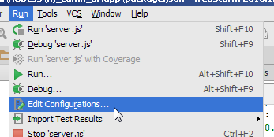
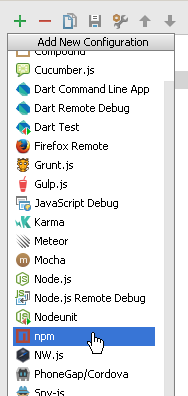
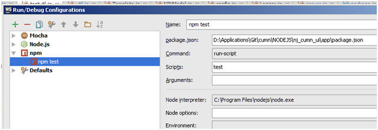
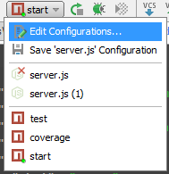

# Installtion
### 1. Install [Nodemon](https://github.com/remy/nodemon)
```
npm install -g nodemon
```
In case you got below error: 
```
nodemon is not recognized as an internal or external command, program or batch file
```
Since node prefix is not in the PATH ENV variable, any of the globally installed modules are not getting recognized. Try:
```
C:\>npm config get prefix
C:\Users\username\AppData\Roaming\npm
C:\>set PATH=%PATH%;C:\Users\username\AppData\Roaming\npm;
```

### 2. Install [Mocha](https://mochajs.org/)
```
npm install -g mocha
```
### 3. Install [Istanbul](https://github.com/gotwarlost/istanbul)
```
npm install -g istanbul
```

----

# Start the application from template
### 1. Copy template from repository
* Backend schedule task: Backend_task
* Node.Js with Express for web services: Backend_ws

### 2. Install dependencies
In terminal, go to app root folder (where *package.json* is located), run `npm install`

### 3. Run scripts introduction (in *package.json*)
- `npm start`: Monitor file changes for automatic server restart (Whilst nodemon is running, type rs to restart Nodemon)
- `npm test`: Monitor file changes for automatic testing
- `npm coverage`: Monitor file changes for automatic testing + coverage report generation

### 4. Setup WebStorm for run scripts



*  Add new npm config



*  Update correct location for package.json and put **test** in Scripts



*  Run npm config just created and nodemon will run with coverage test in Webstorm output window


**Repeat the same steps for `npm coverage` and `npm start`.**



----

# Development

### 1. Name your application
* Fill in application/developer information in package.json
*  Edit Run/Debug config

#### Coding style:
### Native JavsScript
- Naming
  - Use camelCase for (most) identifier names (variables and functions), (exception below). Do not use underscore (_) as the first or last character of a name. It is sometimes intended to indicate privacy, but it does not actually provide privacy.
  - Constructor functions that must be used with the new prefix should start with a capital letter.
  - Global variables in browsers should be in all CAPITAL letters.

- Declarations
  - Variable
    - All variables should be declared before used.
    - It is preferred that each variable declarative statement and comment. They should be listed in alphabetical order if possible.

        ```
        var currentEntry; // currently selected table entry
        var level;        // indentation level
        var size;         // size of table
        ```
  - Function
    - All functions should be declared before they are used.

- Expression
  - Use === and !== over == and !=.
  - Avoid eval().
  - Avoid with.

- Whitespace
  - Every **comma (,)** should be followed by a space or a **line break**.
  - Each **semicolon (;)** at the end of a statement should be followed with a **line break**.
  - Each **semicolon (;)** in the control part of a for statement should be followed with a **space**.
  - No space between nameOfFunction and **left parenthesis (**. One space between **right parenthesis )** and the **left curly brace {**. Example:
    ```
    function nameOfFunction(a, b) {
        // nameOfFunction[no space here](
        // a, b)[one space here]{
    }
    ```

- Node.JS
